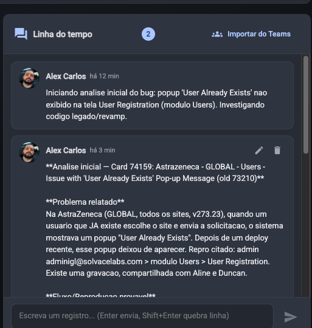

Objetivo: gostaria que a timeline aceitasse automaticamente escrita em markdown, sem precisar de confiuracao do usuario.
Hoje enviamos texto normal ou markdown no campo, mas os campos em md nao ficam formatados, ex:

1. Nao deve precisar que o usuario faca nenhum ajuste
2. ele deve identificar automaticamente se o texto esta em md ou nao
3. deve ter retrocompatibilidade com texto normal
4. quem chama o endpoint pra registrar o timeline, nao precisa realizar nenhuma alteracao