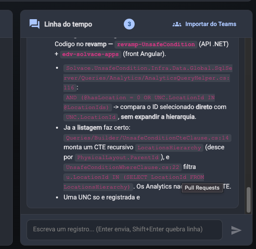

Objetivo: Comentarios grandes em timelines estao vindo grandes e truncando. Provavelmente nem esta salvando tudo no banco de dados

Evidencia:

[
{
"id": 86,
"cardNumber": "74229",
"description": "**Analise inicial (REVISADA) — Card 74229: Oatly - Landskrona - Unsafe Condition - Filtering Graphs by Place**\n\n> Esta versao substitui a analise anterior. Com os prints do cliente ficou claro que a tela e a do **revamp** (Angular + API `revamp-UnsafeCondition`), e nao os relatorios .NET legados. A causa foi **confirmada no codigo e nos dados de producao**.\n\n**Problema relatado**\nEm Unsafe Condition > Analytics > By status (`oatly.solvacelabs.com/unsafe-condition/analytics/unc-analytic/bystatus/unsafe-condition`), o filtro \"Place\" lista Areas e Localizacoes. Ao filtrar por Localizacao os dados aparecem. Ao filtrar por **Area**, o grafico fica vazio.\n\n**Fluxo/Reproducao**\n1. Front (`edv-solvace-apps/projects/unsafe-condition`): o filtro \"Lugar\" (`shared/components/unsafe-condition-filter/unsafe-condition-filter.component.ts:783`, `createLocationFilter`) monta os grupos Departamento / Area / Localizacao e envia os IDs selecionados como `locationIds`.\n2. `unsafe-condition-chart.service.ts` chama `GET /Analytics/UncGroupByStatus?locationIds=<id>` na API `apiUrlUnsafeCondition`.\n3. API (`revamp-UnsafeCondition`): `AnalyticsController.cs:153` -> `UnsafeConditionGroupByStatusHandler` -> `UnsafeConditionGroupByStatusQueries` -> `AnalyticsQueryHelper.WHERE_CLAUSE_FILTERS`.\n\n**Investigacao no codigo**\nCodigo no **revamp — `revamp-UnsafeCondition`** (API .NET) + **`edv-solvace-apps`** (front Angular).\n\n- `Solvace.UnsafeCondition.Infra.Data.Global.SqlServer/Queries/Analytics/AnalyticsQueryHelper.cs:116`:\n  `AND (@hasLocation = 0 OR UNC.LocationId IN @LocationIds)` -> compara o ID selecionado **direto** com `UNC.LocationId`, **sem expandir a hierarquia**.\n- Ja a **listagem** faz certo: `Queries/Builder/UnsafeConditionCteClause.cs:14` monta um CTE recursivo `LocationsHierarchy` (desce por `PhysicalLayout.ParentId`), e `UnsafeConditionWhereClause.cs:22` filtra `u.LocationId IN (SELECT LocationId FROM LocationsHierarchy)`. Os Analytics nao usam esse CTE.\n- Uma UNC so e registrada e",
"userId": "8885cea1-ed3d-47b8-8390-796cdf679194",
"userName": "Alex Carlos",
"sourceMessageId": null,
"createdAt": "2026-09-24T17:03:22.800804+00:00",
"updatedAt": null
},
{
"id": 85,
"cardNumber": "74229",
"description": "**Analise inicial — Card 74229: Oatly - Landskrona - Unsafe Condition - Filtering Graphs by Place**\n\n**Problema relatado**\nNos graficos do modulo Unsafe Condition (site Oatly - Landskrona), o filtro \"Lugar\" (Place) oferece Areas e Localizacoes. Ao selecionar uma **Area** o grafico nao retorna dados; ao selecionar uma **Localizacao**, funciona.\n\n**Fluxo/Reproducao provavel**\n1. Unsafe Condition > Graficos (Mensal `Report/UnsafeConditionByMonth` ou Idade `Report/UnsafeConditionByAge`) > Filtros.\n2. O combo \"Lugar\" e carregado pela API util (`/api/util/gettype`, `type_name: \"location\"`), agrupado em DEPARTAMENTO / AREA / LOCALIZACAO.\n3. O ID selecionado vai como `cboLocation` para o backend, que \"expande\" o ID para incluir os filhos (Area -> Localizacoes) antes de filtrar `unc.LOCATION_ID IN (...)`.\n4. Uma UNC so pode ser registrada em Localizacao (`UnsafeConditionController.cs:473`, `FilterLocation(..., {4}, ...)`, ou seja UDAType 4). Entao, para filtrar por Area, **a expansao para as Localizacoes filhas tem que funcionar**, senao o `IN (...)` fica so com o ID da Area e nao casa com nenhuma UNC.\n\n**Investigacao no codigo**\nCodigo no **legado (edv-solvace)**, modulo .NET Core `solvace-core/unsafe_condition` (nao existe revamp do Unsafe Condition). O combo vem de `edv-solvace-api`.\n\n- Combo \"Lugar\" (frontend): `view_shared/wwwroot/js/loadSelectOptions.class.js:599` (`location.getAll`), usado em `unsafe_condition/Views/unc_rpt_age.cshtml:290` e `unc_rpt_monthly.cshtml:155`. Agrupa por `groupId`: 2=Departamento, 3=Area, 4=Localizacao.\n- Origem do `groupId`: `edv-solvace-api/.../ApiHelpers/DataShared/DapperGenericHelpers.cs:336` (`GetLocationFull`) -> `UDAType as GroupId` de `vw_emp_EmployeeUnityDepartArea` (**classifica pelo UDAType**).\n- Expansao no backend: `solvace-core/helpers/Helpers/LocationHelper.cs:11` (`GetAllRelatedLocationIds`) -> classifica o ID pelo **`UDALevel`** de `VW_MST_CommonLocation` (0=Unidade, 1=Departamento, 2=Area, 3=Local) e so busca filhos com `U",
"userId": "8885cea1-ed3d-47b8-8390-796cdf679194",
"userName": "Alex Carlos",
"sourceMessageId": null,
"createdAt": "2026-09-24T15:37:30.760955+00:00",
"updatedAt": null
},
{
"id": 84,
"cardNumber": "74229",
"description": "Iniciando analise inicial do bug: filtro por Place (Area) nos graficos do Unsafe Condition nao retorna dados; Locations funciona. Investigando codigo do dashboard/graficos.",
"userId": "8885cea1-ed3d-47b8-8390-796cdf679194",
"userName": "Alex Carlos",
"sourceMessageId": null,
"createdAt": "2026-09-24T15:32:27.779296+00:00",
"updatedAt": null
}
]