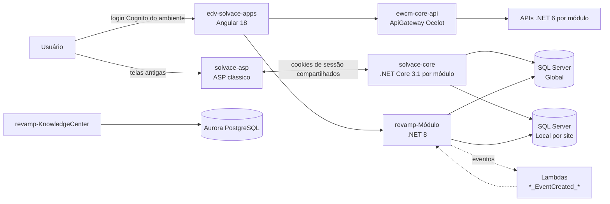

## Os mundos de código

| Mundo | Repositório | Tecnologia | O que tem |
|---|---|---|---|
| Legado — telas antigas | `edv-solvace/solvace-asp` | ASP clássico (VBScript) | Telas por sigla em `systems/<sigla>/`, includes de sessão/conexão em `systems/includes/asp/` |
| Legado — core | `edv-solvace/solvace-core` | ASP.NET Core 3.1 (MVC + Razor), **um app por módulo** | action_plan, checklist, defect_tag, digital_obeya, training, work_permit… + `data_access` (EF, contextos Global/Corporate/Local) e `helpers` (sessão, cookies) |
| Front novo | `edv-solvace-apps` | Angular 18 monorepo, um app por módulo + `lib-shared-*` | Telas novas; fala com o revamp e com a ewcm-core-api pelas URLs do `environment.<amb>.ts` |
| API de integrações | `edv-solvace-api` (pasta `ewcm-core-api`) | .NET 6 por módulo + ApiGateway Ocelot + ApiAuthentication (Cognito) | APIs REST por módulo, widgets do Digital Obeya (`dob_*`), OpenSearch, feed, toast |
| Revamp | `electradv/revamp-<Módulo>` (um repo por módulo; o monorepo `revamp` antigo tem 43 soluções) | .NET 8, hexagonal + CQRS (MediatR) | Reescrita dos módulos: `.API`, `.Application`, `.Application.Abstractions`, `.Domain`, `.Infra.Data.<Global/Local>.SqlServer`, Lambdas |

## Como uma requisição anda

## Multi-tenant (o que confunde nos bugs)
- **Ambiente** = cliente (ex.: `takeda`, `sandboxtakeda`, `devsp`): tem host próprio (`<ambiente>.solvacelabs.com`), **pool do Cognito
  com o mesmo nome** e configurações em Secrets Manager `environment/<host>`.
- **Site** = planta do cliente: cada site tem um **banco Local** (`DB_<CLIENTE>_<AMB>_LOCAL_<SITE>`); o **Global** é por cliente
  (`DB_<CLIENTE>_<AMB>_GLOBAL`, tem `TB_WCM_USER`). O usuário tem site de origem e `LAST_SITE_ID` (último site ativo) — muito
  bug de "não vejo o registro" é site errado.
- **Corporate** (`solvace-corporate`): dados cross-BU (usuários/autenticação).
- Onde fica o banco de cada cliente: alias RDS `prod`, `prod1`…`prod4` (ver `infra-aws`).

## Como achar o projeto de um card
1. Tela nova (Angular) com URL `…/<app>/…` → `edv-solvace-apps/projects/<app>` + API em `apiUrl<Módulo>` → revamp ou ewcm-core-api.
2. Tela `.asp` → `solvace-asp/systems/<sigla>/`; tela Razor (.NET Core) → `solvace-core/<modulo>/`.
3. Dado/regra compartilhados (usuário, site, preferência) → `solvace-core/data_access` + `helpers`.
4. Sincronização entre módulos atrasada/errada → Lambdas `<MOD>_<Entidade>_EventCreated_<AMB>` (ver `infra-aws`).
