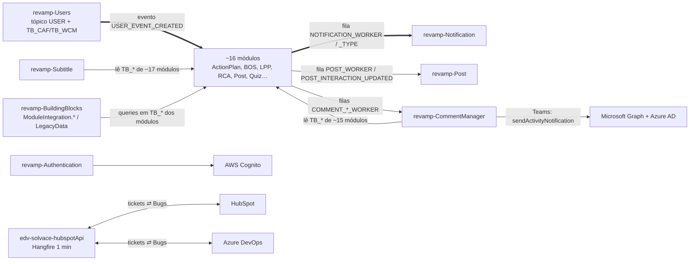

## Mapa de interdependências do revamp (extraído do código em 2026-09-30, 54 repositórios)

Gerado por `mapear.py relacoes` sobre `kb-mirror` (todos os `electradv/revamp-*` + `edv-solvace-hubspotApi`). Cada relação tem
evidência (arquivo:linha ou chave de config) na ficha do projeto (`000-projeto.md`) e na seção `040-integracoes` dele.
Na tela **Base Solvace → Ecossistema** o mesmo mapa aparece como grafo interativo (filtros por tipo, clique para ver vizinhos).

## Hubs (onde um bug costuma se propagar)
| Hub | Como os outros dependem dele | Quem |
|---|---|---|
| **revamp-Users** | Publica o tópico SNS **USER**; cada módulo tem fila própria `<SIGLA>_USER_EVENT_CREATED_<AMB>` + Lambda que replica o usuário no banco do módulo. Outros leem direto `TB_CAF_*` (cargo/função) | ActionPlan, Alert, BOS, Communication, DefectTag, Fishbone, LPP, Post, Praise, Quiz, RCA, Reaction, ScoreCard, Survey, UnsafeCondition, WhyWhy (eventos); Alert, Authentication, BOS, LPP, Post, Quiz, Reaction, Training, BuildingBlocks (tabelas) |
| **revamp-Notification** | Fila SQS `NOTIFICATION_WORKER_<AMB>` (e `NOTIFICATION_TYPE_<AMB>`): quem notifica só envia a mensagem | 17 módulos (inclusive Users, CommentManager, Subtitle, Hashtag) |
| **revamp-Post** | Filas `POST_WORKER_<AMB>` / `POST_INTERACTION_UPDATED_<AMB>` (feed) | Comment, LPP, RCA, Reaction, WhiteBoard, WhyWhy |
| **revamp-CommentManager** | Filas `COMMENT_HEADER/MENTION/GROUP_DELETE_WORKER_<AMB>`; lê tabelas de ~15 módulos para montar o link/redirect do comentário; manda atividade no Teams (Graph) | ActionPlan, Alert, Comment, Kaizen |
| **revamp-MasterData** | Tabelas `TB_MST_*` / `TB_MNT_*` (equipamento, falhas, custos) lidas direto | ActionPlan, Alert, BOS, BuildingBlocks, CommentManager, DefectTag, Post, RCA, UnsafeCondition |
| **revamp-DigitalObeya** | Tabelas `TB_DOB_*` (widgets/salas) alimentadas por outros módulos | ActionPlan, BuildingBlocks, Comment, CommentManager, Copilot, ModuleIntegration, Subtitle |
| **revamp-RCA** | Consome os tópicos CENTERLINE, KAIZEN, CHECKLIST, DOCUMENTATION, LPP; publica RCA (consumido por WhyWhy) | — |

## Regras que o mapa deixa claras
- **Cross-módulo é quase sempre banco compartilhado ou evento — HTTP entre módulos quase não existe** (só Copilot → Authentication).
  Mudou coluna de `TB_<SIGLA>_*`? Veja "Usado por" do dono: Subtitle, CommentManager e BuildingBlocks (`ModuleIntegration.*`,
  `LegacyData`) leem tabelas de quase todos.
- Usuário "não aparece" num módulo → Lambda `<SIGLA>_USER_EVENT_CREATED_<AMB>` do módulo (fila parada/DLQ), não o Users.
- Notificação não chegou → primeiro a fila `NOTIFICATION_WORKER_<AMB>`, depois o módulo que envia.
- ⚠️ `lambda_bos_user_create_event` está declarada em **revamp-BOS e revamp-Fishbone** com o mesmo nome — um deploy sobrescreve o outro.
- Integrações externas: Microsoft Graph/Azure AD (Comment, CommentManager → Teams), Cognito (Authentication), S3 (Reaction e
  arquivos em geral), HubSpot ⇄ Azure DevOps (`edv-solvace-hubspotApi`, ver projeto próprio).

Atualizar: `mapear.py tudo <kb-mirror> <saida> --curados <kb-revisada>` e `arch.sh publicar-pasta <saida>` (skill base-solvace).
