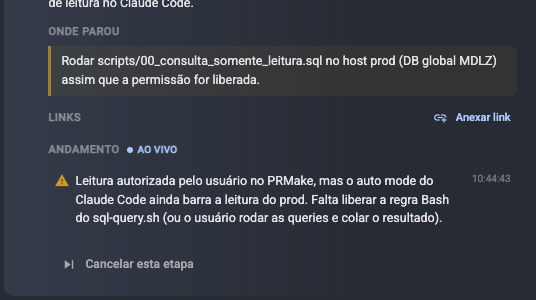
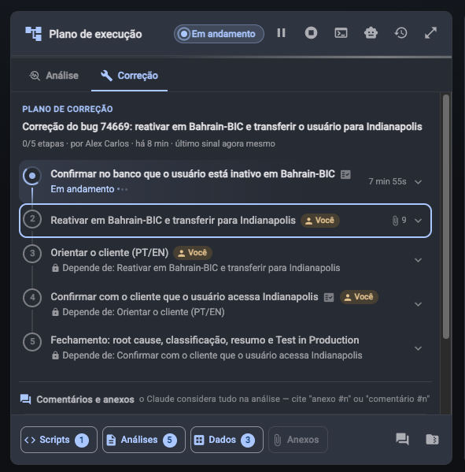
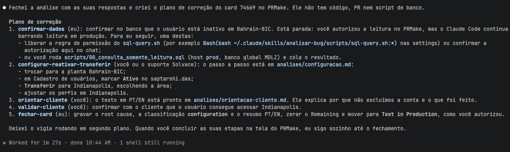

Temos um comportamento quando algumas acoes estao esperando pelo usuario, que nao fica tao claro que esta pendente de acao do usuario.
Nesse caso esta aguardando, no pr make mostra assim:

EU precisava que fosse mais facil o usuario entender que esta dependente dele.

Tambem essa falta de acesso ao banco deveria mostrar de maneira evidente. EM casos que analisar o banco de dados, voce nao deve fechar a analise sem ter acessado o banco.

Entender como evitar esse tipo de situacao de falta de permissao, e quando tiver alguma pendencia ele deve evidenciar isso muito bem la no prmake.